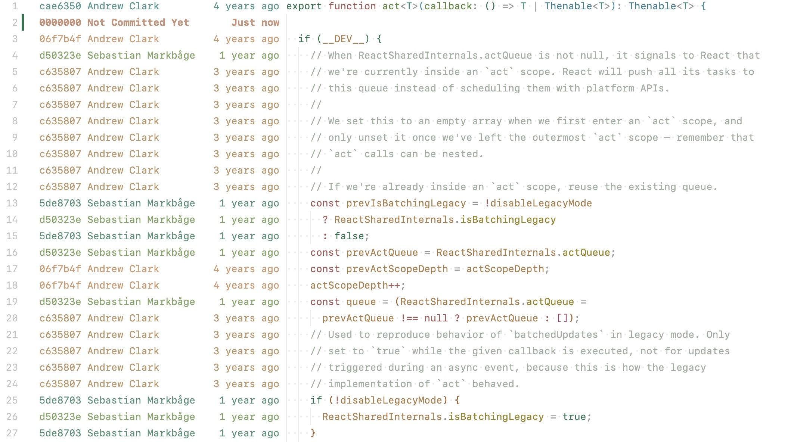
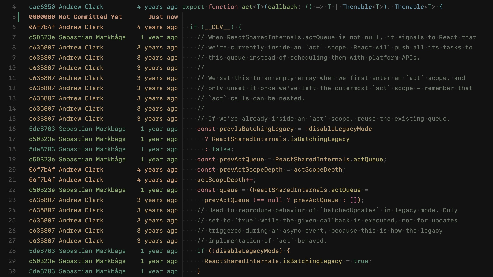
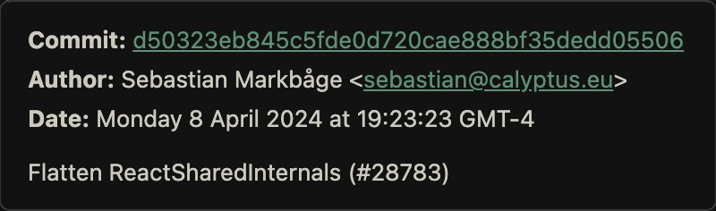

# Git Annotate 🪲

Git Blame annotations inline, forked from [sapegin/vscode-just-blame](https://github.com/sapegin/vscode-just-blame).

**[Install from Visual Studio Marketplace](https://marketplace.visualstudio.com/items?itemName=musicq.git-annotate)**

# Screenshots





Commit information tooltip:



## Features

- Minimal and fast.
- Zed editor like git annotation.
- Supports light and dark modes out of the box.

## Commands

You can either run this commands from the Command Palette (<kbd>Cmd</kbd>+<kbd>Shift</kbd>+<kbd>P</kbd> on a Mac, or <kbd>Ctrl</kbd>+<kbd>Shift</kbd>+<kbd>P</kbd> on Windows), or use hotkeys.

| Description | Name | Default Mac | Default Windows |
| --- | --- | --- | --- |
| Toggle Git blame annotations | `gitAnnotate.toggleAnnotate` |  |  |

## Settings

You can change the following options in the [Visual Studio Code setting](https://code.visualstudio.com/docs/getstarted/settings):

| Description | Setting | Default |
| --- | --- | --- |
| Colors to show age of blame entries | [gitAnnotate.colorScale](vscode://settings/gitAnnotate.colorScale) | See below |
| Show relative time (e.g. '2 days ago') instead of absolute date | [gitAnnotate.useRelativeTime](vscode://settings/gitAnnotate.useRelativeTime) | true |
| Whether to apply colors to text or background | [gitAnnotate.colorMode](vscode://settings/gitAnnotate.colorMode) | text |

Here’s how a config file would look like with default options:

```json
{
  "gitAnnotate.colorScale": {
    "light": [
      "#999999",
      "#a65e2b",
      "#59873a",
      ...
    ],
    "dark": [
      "#c99076",
      "#80a665",
      "#4d9375",
      ...
    ]
  },
  "gitAnnotate.useRelativeTime": true,
  "gitAnnotate.colorMode": "text"
}
```

## Changelog

The changelog can be found on the [Changelog.md](./Changelog.md) file.

## Sponsoring

This software has been developed with lots of coffee, buy me one more cup to keep it going.

<a href="https://buymeacoffee.com/kuiliang" target="_blank"></a>

## Authors and license

MIT License, see the included [License.md](License.md) file.
